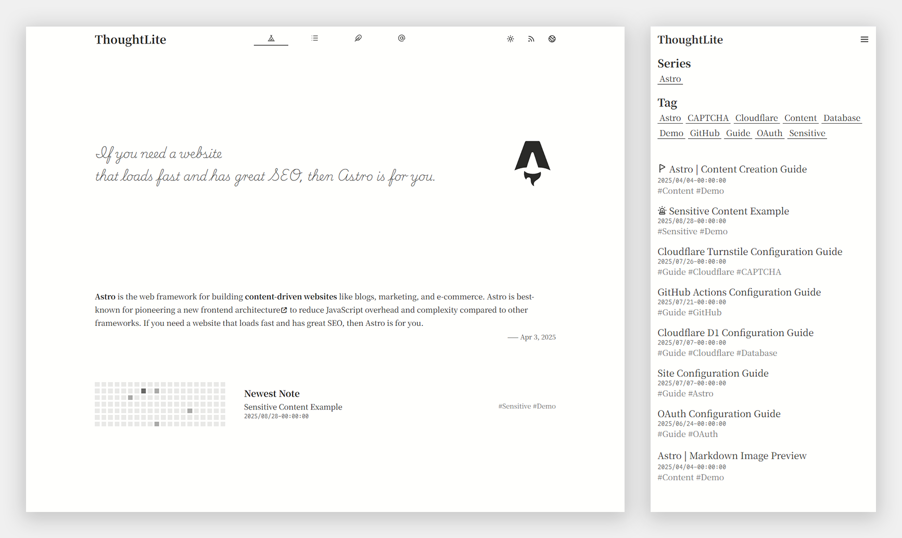
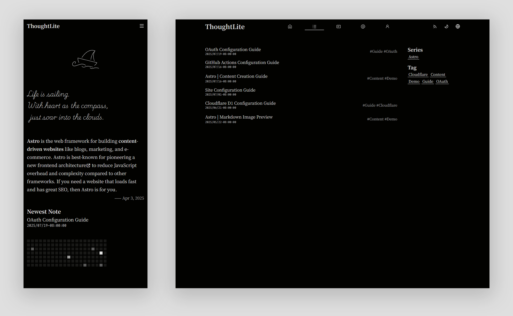

# ThoughtLite

<div align="center">
    <p>
        
        
    </p>
    <p>
        <a href="https://github.com/tuyuritio/astro-theme-thought-lite/releases/latest"></a>
        <a href="https://raw.githubusercontent.com/tuyuritio/astro-theme-thought-lite/refs/heads/main/LICENSE"></a>
        <a href="https://deepwiki.com/tuyuritio/astro-theme-thought-lite"></a>
    </p>
    <p>A modern <a href="https://astro.build/">Astro</a> theme, focused on content creation 🌟</p>
    <p>
        <small><ins>English</ins></small>
        <small><a href="README.zh-cn.md">简体中文</a></small>
        <small><a href="README.ja.md">日本語</a></small>
    </p>
</div>

> [!NOTE]
> - `main` branch: Static build, can be deployed on any static hosting platform.
> - `cloudflare` branch✅: Enables built-in comment system, only deployable on Cloudflare.

🎬 **Live Demo**: [Cloudflare Workers](https://thought-lite.ttio.workers.dev/)

## ✨ Features

- [x] **Responsive Design** - Adaptive for mobile, tablet, and desktop.
- [x] **Light / Dark Mode** - Auto-follows system preference with manual toggle support.
- [x] **CSR Dynamic Content Filtering** - List filtering and pagination via History API.
- [x] **i18n Support** - Extensible multilingual support, also works perfectly in monolingual mode.
- [x] **Sitemap & Feed Subscription** - Automated generation of Sitemap and Atom Feed.
- [x] **OpenGraph Support** - Built-in Open Graph meta tags for optimized social media sharing.
- [x] **Comment System** - Based on Cloudflare D1, easy deployment with privacy control; supports OAuth authentication and guest comments.
- [x] **Desktop Notifications** - Real-time notifications using Web Push API.

## 📋 Prerequisites

Before you begin, make sure you have the following accounts:

- [Cloudflare Account](https://dash.cloudflare.com/sign-up) - For deployment and database hosting
- [GitHub Account](https://github.com/signup) - For code hosting and automated deployment

## ⚡️ Quick Start

### Using Astro Command

Run the following command:

```sh
# `cloudflare` at the end is the branch name, do not omit it!
pnpm create astro --template tuyuritio/astro-theme-thought-lite#cloudflare

# Follow the interactive prompts to create the project

cd <your-project-name>
pnpm db:migrate:local    # Generate local test database
pnpm dev
```

### Using Template

1. [Use this template](https://github.com/new?template_name=astro-theme-thought-lite&template_owner=tuyuritio) to create a new repository (enable `Include all branches`) or [fork](https://github.com/tuyuritio/astro-theme-thought-lite/fork) this repository (uncheck `Copy the main branch only`).
2. Run the following commands:

```sh
git clone <your-repo-url>
cd <your-repo-name>
pnpm install
pnpm db:migrate:local    # Generate local test database
pnpm dev
```

## 🔧 Configuration

1. Create Cloudflare D1, refer to [Cloudflare D1 Configuration Guide](src/content/note/en/cloudflare-d1.md).
2. Configure Cloudflare Turnstile, refer to [Cloudflare Turnstile Configuration Guide](src/content/note/en/cloudflare-turnstile.md).
    - You can skip this step if you don't enable anonymous comments.
3. Configure OAuth authentication, refer to [OAuth Configuration Guide](src/content/note/en/oauth.md).
4. Customize site configuration and internationalization (i18n) by modifying the following files, refer to [Site Configuration Guide](src/content/note/en/configuration.md) and [Internationalization Configuration Guide](src/content/note/en/internationalization.md):
    - `.env`
    - `astro.config.ts`
    - `site.config.ts`

## 💻 Commands

The theme provides the following commonly used commands:

| Command | Action |
| --- | --- |
| `pnpm install` | Install project dependencies |
| `pnpm update` | Update project dependencies |
| `pnpm new` | Create a new content file |
| `pnpm dev` | Start the local development server (default: `http://localhost:4321`) |
| `pnpm check` | Run Astro type checking |
| `pnpm build` | Build the production version |
| `pnpm preview` | Preview the built site |
| `pnpm format` | Format code |
| `pnpm lint` | Lint code |
| `pnpm deploy` | Deploy to Cloudflare |
| `pnpm deploy:dry` | Simulate deployment |
| `pnpm db:migration` | Generate database migration files |
| `pnpm db:migrate:local` | Apply database migrations locally |
| `pnpm db:migrate:remote` | Apply database migrations remotely |

## 🚀 Deployment

```sh
pnpm build
pnpm deploy
```

For **automated deployment** using GitHub Actions, refer to [GitHub Actions Configuration Guide](src/content/note/en/github-actions.md).

## 🔄 Updates

Run the following commands to sync upstream updates:

```sh
git remote add theme https://github.com/tuyuritio/astro-theme-thought-lite.git
git fetch theme
git merge theme/cloudflare  # Add `--allow-unrelated-histories` flag for first update
pnpm install
pnpm db:migrate:local
```

## ✍️ Content Creation

Content creation is centralized in the `src/content` directory, mainly including:

- `note` - Focused on carefully crafted and detailed long-form works
- `jotting` - Lightweight and immediate content recording
- `preface` - Displayed on the homepage as the first impression
- `information` - Containing various descriptive content

For details, refer to the [Content Creation Guide](src/content/note/en/content.md).

## 🤝 Contributing

All kinds of contributions are welcome and appreciated!

- Help promote the project or assist other users
- Report [issues](https://github.com/tuyuritio/astro-theme-thought-lite/issues) or suggest new features
- Improve documentation or help with internationalization (i18n)
- Submit code contributions - see the [Code Contribution Guide](CONTRIBUTING.md) for more details

## 🙏 Acknowledgments

### Tech Stack

- **Core Framework** - [Astro](https://astro.build/)
- **Core Language** - [TypeScript](https://www.typescriptlang.org/)
- **UI Components** - [Svelte](https://svelte.dev/)
- **CSS Engine** - [Tailwind CSS](https://tailwindcss.com/)
- **Icons** - [Iconify](https://iconify.design/)
- **Fonts** - [Google Fonts](https://fonts.google.com/) | [ZeoSeven Fonts](https://fonts.zeoseven.com/)
- **Image Viewer** - [Medium Zoom](https://github.com/francoischalifour/medium-zoom)
- **SPA Transitions** - [Swup](https://swup.js.org/)
- **Time Handling** - [Luxon](https://moment.github.io/luxon/)
- **OAuth** - [Arctic](https://arcticjs.dev/)
- **Code Quality** - [Biome](https://biomejs.dev/)
- **ORM** - [Drizzle ORM](https://orm.drizzle.team/)
- **Database** - [Cloudflare D1](https://developers.cloudflare.com/d1/)
- **Edge Deployment** - [Cloudflare Workers](https://workers.cloudflare.com/)

### Inspiration

- [Astro Sphere](https://github.com/markhorn-dev/astro-sphere)
- [astro-vitesse](https://github.com/adrian-ub/astro-vitesse)
- [Miniblog](https://github.com/nicholasdly/miniblog)
- [AstroPaper with I18n](https://github.com/yousef8/astro-paper-i18n)

## 📜 License

This project is licensed under [GPLv3](LICENSE), allowing free modification and distribution, but the original copyright notice must be retained.
