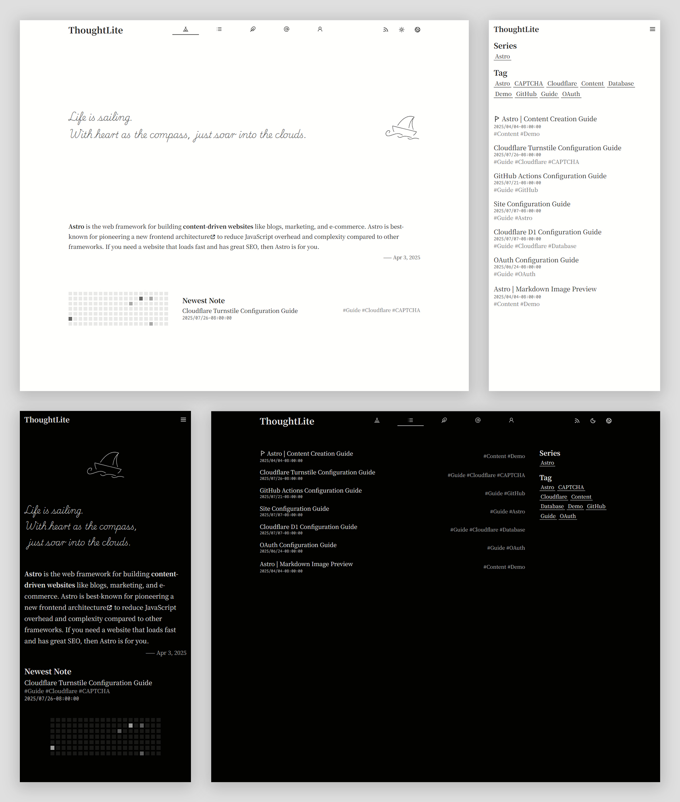

# ThoughtLite

<div align="center">
    
    <p></p>
    <p>A modern <a href="https://astro.build/">Astro</a> theme optimized for <a href="https://www.cloudflare.com/">Cloudflare</a>, focused on content creation 🌟</p>
    <small><ins>English</ins></small> <small><a href="README_zh-cn.md">简体中文</a></small> <small><a href="README_ja.md">日本語</a></small>
</div>

## ✨ Features

📱 **Responsive Design** - Adaptive for mobile, tablet, and desktop.\
🌗 **Light / Dark Mode** - Auto-follows system preference with manual toggle support.\
📃 **SSR Dynamic Content Filtering** - List filtering and pagination via History API.\
🌏 **i18n Support** - Easy to extend and manage multilingual content.\
📰 **Sitemap & Feed Subscription** - Automated generation of Sitemap and RSS, Atom, JSON Feed.\
🔗 **OpenGraph Support** - Built-in Open Graph meta tags for optimized social media sharing.\
📝 **Comment System** - Based on Cloudflare D1, easy deployment with privacy control; supports OAuth authentication and guest comments.\
🔔 **Desktop Notifications** - Real-time notifications using Web Push API.

## 📋 Prerequisites

Before you begin, make sure you have the following accounts:

- [Cloudflare Account](https://dash.cloudflare.com/sign-up) - For deployment and database hosting
- [GitHub Account](https://github.com/signup) - For code hosting and automated deployment

## 📦 Installation

```sh
git clone https://github.com/tuyuritio/astro-theme-thought-lite.git
cd astro-theme-thought-lite
git remote rename origin theme
git remote add origin <your-git-repo>
npm install
```

## 🔧 Configuration

1. Create Cloudflare D1, refer to [Cloudflare D1 Configuration Guide](src/content/note/en/cloudflare-d1.md).
2. Configure Cloudflare Turnstile, refer to [Turnstile Configuration Guide](src/content/note/en/turnstile.md).
3. Configure OAuth authentication, refer to [OAuth Configuration Guide](src/content/note/en/oauth.md).
4. Basic site information configuration, refer to [Site Configuration Guide](src/content/note/en/configuration.md).
5. Create `.env` file and add variables:

    ```sh
    cp .env.example .env
    ```

    | Variable | Description |
    | - | - |
    | `PUBLIC_TIMEZONE`* | Default display timezone, refer to [Timezone List](https://en.wikipedia.org/wiki/List_of_tz_database_time_zones#List) |
    | `PASS_KEY`* | Used for generating tokens, 16-byte Base64 format key, generate with `openssl rand -base64 16` |
    | `NOTIFY_PUBLIC_KEY`* | VAPID public key for desktop push notifications, generate with `npx web-push generate-vapid-keys` |
    | `NOTIFY_PRIVATE_KEY`* | VAPID private key for desktop push notifications, generated along with public key |
    | `AUTHOR_ID` | Author ID for identifying site author in comment section; check in [Cloudflare D1 Panel](https://dash.cloudflare.com/?to=/:account/workers/d1) |

    `*` indicates required options.

## 💻 Start Development

```sh
# Generate local test database
npm run db:migrate:local

# Start development server
npm run dev
```

## 🚀 Deployment

```sh
npm run build
npm run deploy
```

For **automated deployment** using GitHub Actions, refer to [GitHub Actions Configuration Guide](src/content/note/en/github-actions.md).

## 🔄 Updates

```sh
git checkout main
git pull origin main
git fetch theme
git merge theme/main
npm i
npm run db:migrate:local
```

## ✍️ Content Creation

Content creation is centralized in the `src/content` directory, mainly including:

- `note` - Notes
- `jotting` - Jottings
- `preface` - Preface
- `information` - Information

All sections support multiple languages. Please create language subdirectories under the corresponding section directory before writing content. For details, refer to [Content Creation Guide](src/content/note/en/content.md).

## 🙏 Acknowledgments

### Tech Stack

- **Main Framework** - [Astro](https://astro.build/)
- **Type Checking** - [TypeScript](https://www.typescriptlang.org/)
- **Style Sheets** - [Less.js](https://lesscss.org/)
- **Reactive Components** - [Svelte](https://svelte.dev/)
- **CSS Engine** - [UnoCSS](https://unocss.dev/)
- **Icons** - [Iconify](https://iconify.design/)
- **Serif Fonts** - [Google Fonts](https://fonts.google.com/)
- **Monospace Fonts** - [ZeoSeven Fonts](https://fonts.zeoseven.com/)
- **Image Viewer** - [Medium Zoom](https://github.com/francoischalifour/medium-zoom)
- **TypeScript ORM** - [Drizzle ORM](https://orm.drizzle.team/)
- **Database** - [Cloudflare D1](https://developers.cloudflare.com/d1/)
- **Deployment** - [Cloudflare Workers](https://workers.cloudflare.com/)

### Inspiration

- [Fuwari](https://github.com/saicaca/fuwari)
- [astro-vitesse](https://github.com/adrian-ub/astro-vitesse)
- [Astro Blog](https://github.com/williamcachamwri/astro-blog)
- [Astro Theme Pure](https://github.com/cworld1/astro-theme-pure)
- [AstroPaper with I18n](https://github.com/yousef8/astro-paper-i18n)

## 📜 License

This project is licensed under [GPLv3](LICENSE).
