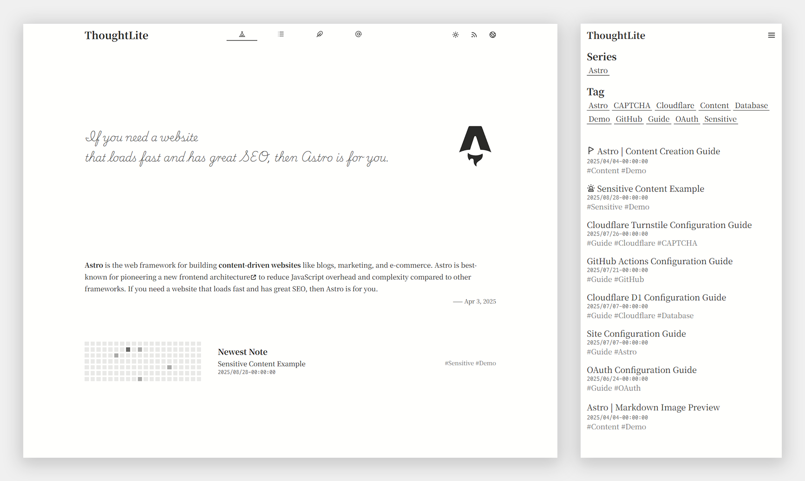
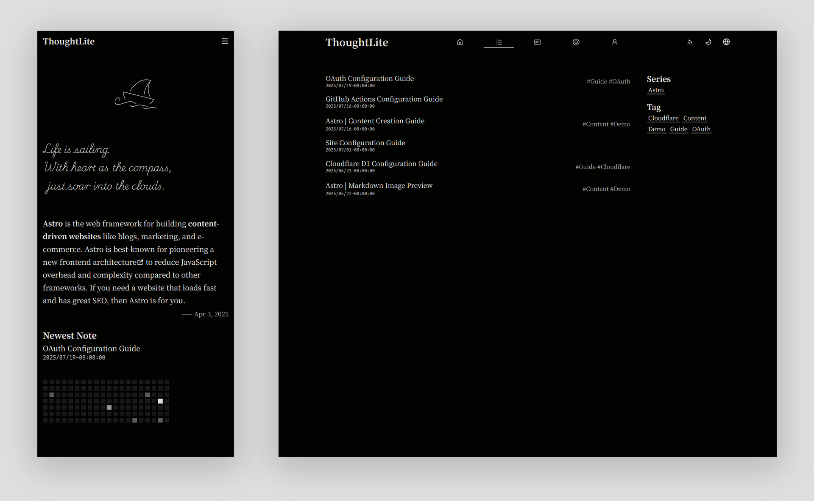

# ThoughtLite

<div align="center">
    <p>
        
        
    </p>
    <p>
        <a href="https://github.com/tuyuritio/astro-theme-thought-lite/releases/latest"></a>
        <a href="https://raw.githubusercontent.com/tuyuritio/astro-theme-thought-lite/refs/heads/main/LICENSE"></a>
        <a href="https://deepwiki.com/tuyuritio/astro-theme-thought-lite"></a>
    </p>
    <p>一款专注内容创作的现代化 <a href="https://astro.build/">Astro</a> 主题 🌟</p>
    <p>
        <small><a href="README.md">English</a></small>
        <small><ins>简体中文</ins></small>
        <small><a href="README.ja.md">日本語</a></small>
    </p>
</div>

> [!NOTE]
> - `main` 分支✅：静态化构建，可部署在任何静态托管平台。
> - `cloudflare` 分支：启用内置评论系统，仅支持在 Cloudflare 部署。

🎬 **在线演示**：[Vercel](https://thought-lite.vercel.app/zh-cn)

## ✨ 特性

- [x] **响应式设计** - 移动端、平板、桌面自适应。
- [x] **亮色 / 深色模式** - 自动跟随系统，并支持手动切换。
- [x] **CSR 动态内容筛选** - 通过 History API 实现的列表筛选和分页。
- [x] **i18n 支持** - 可扩展的多语言支持，单语言模式同样适用。
- [x] **Sitemap 及 Feed 订阅** - 自动化生成 Sitemap 和 Atom Feed。
- [x] **OpenGraph 支持** - 内置 Open Graph 元标签，优化社交媒体分享效果。

## ⚡️ 快速上手

### 使用 Astro 命令

运行如下命令：

```sh
pnpm create astro --template tuyuritio/astro-theme-thought-lite

# 根据交互提示创建项目

cd <your-project-name>
pnpm dev
```

### 使用模板

1. [使用此模板](https://github.com/new?template_name=astro-theme-thought-lite&template_owner=tuyuritio)创建新的仓库或 [Fork](https://github.com/tuyuritio/astro-theme-thought-lite/fork) 此仓库。
2. 运行如下命令：

```sh
git clone <your-repo-url>
cd <your-repo-name>
pnpm install
pnpm dev
```

## 🔧 配置

主题相关配置请参阅以下文档：

- [Astro 配置参考](https://docs.astro.build/zh-cn/reference/configuration-reference/)
- [站点配置指南](https://thought-lite.vercel.app/zh-cn/note/configuration)
- [国际化配置指南](https://thought-lite.vercel.app/zh-cn/note/internationalization)

## 💻 命令

主题提供了以下常用命令：

| 命令 | 行为 |
| --- | --- |
| `pnpm install` | 安装项目依赖 |
| `pnpm update` | 更新项目依赖 |
| `pnpm new` | 创建新的内容文件 |
| `pnpm dev` | 启动本地开发服务器（默认：`http://localhost:4321`） |
| `pnpm check` | 运行 Astro 类型检查 |
| `pnpm build` | 构建生产版本 |
| `pnpm preview` | 预览构建后的站点 |
| `pnpm format` | 代码格式化 |
| `pnpm lint` | 代码检查 |

## 🚀 部署

当前分支可完全静态化构建，部署在任何静态托管平台。

各平台部署方法请参阅 [Astro 官方部署指南](https://docs.astro.build/zh-cn/guides/deploy/)。

[](https://vercel.com/new/clone?repository-url=https://github.com/tuyuritio/astro-theme-thought-lite&project-name=astro-blog-thought-lite&repository-name=astro-blog-thought-lite&teamSlug=tuyuritios-projects)
[](https://app.netlify.com/integration/start/deploy?repository=https://github.com/tuyuritio/astro-theme-thought-lite)

## 🔄 更新

运行以下命令以同步上游更新：

```sh
git remote add theme https://github.com/tuyuritio/astro-theme-thought-lite.git
git fetch theme
git merge theme/main    # 首次更新需添加 `--allow-unrelated-histories` 参数
pnpm install
```

## ✍️ 创作

创作内容集中在 `src/content` 目录下，主要包含以下部分：

- `note` - 文记，专注于精心构思、内容详实的长篇作品
- `jotting` - 随笔，轻量级、即时性的内容记录
- `preface` - 序文，作为第一印象在站点首页展示
- `information` - 信息，包含各类说明性内容

详情请参阅[内容创作指南](https://thought-lite.vercel.app/zh-cn/note/content)。

## 🤝 贡献

欢迎并感谢所有形式的贡献！

- 宣传项目或帮助其他用户
- 提交 [issues](https://github.com/tuyuritio/astro-theme-thought-lite/issues) 或新功能建议
- 改进文档及国际化（i18n）支持
- 贡献代码
- 更多信息请参阅[代码贡献指南](CONTRIBUTING.md)

## 🙏 鸣谢

### 技术栈

- **核心框架** - [Astro](https://astro.build/)
- **核心语言** - [TypeScript](https://www.typescriptlang.org/)
- **UI 组件** - [Svelte](https://svelte.dev/)
- **CSS 引擎** - [Tailwind CSS](https://tailwindcss.com/)
- **图标** - [Iconify](https://iconify.design/)
- **字体** - [Google Fonts](https://fonts.google.com/) | [ZeoSeven Fonts](https://fonts.zeoseven.com/)
- **图片查看器** - [Medium Zoom](https://github.com/francoischalifour/medium-zoom)
- **SPA 过渡** - [Swup](https://swup.js.org/)
- **代码质量** - [Biome](https://biomejs.dev/)
- **静态部署** - [Vercel](https://vercel.com/)

### 灵感来源

- [Astro Sphere](https://github.com/markhorn-dev/astro-sphere)
- [astro-vitesse](https://github.com/adrian-ub/astro-vitesse)
- [Miniblog](https://github.com/nicholasdly/miniblog)
- [AstroPaper with I18n](https://github.com/yousef8/astro-paper-i18n)

## 📜 许可证

本项目采用 [GPLv3](LICENSE) 进行授权，可自由修改与分发，但须保留原版权声明。
